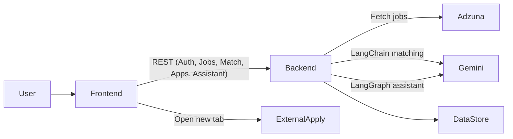
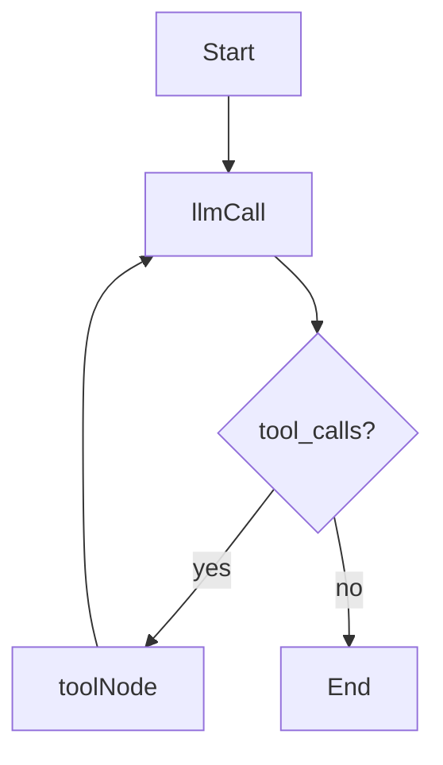

# AI-Powered Job Tracker with Smart Matching

React + Fastify job tracking platform that fetches jobs (Adzuna), scores them against a single uploaded resume (LangChain), tracks applications with a “return to app” popup flow, and includes a LangGraph-powered assistant that can directly update frontend filters in real time.

## Live demo

- **Frontend (Netlify)**: _add link_
- **Backend (Render)**: _add link_

## Architecture diagram



### Main components

- **Frontend (`frontend/`)**: React (Vite) SPA
  - Pages: Login, Job Feed, Applications
  - Core UI: Filters panel, job feed cards, best matches, apply-return popup, floating assistant chat bubble
- **Backend (`backend/`)**: Fastify API
  - `POST /auth/login`, `GET /me`
  - Resume: `POST /resume`, `GET /resume`
  - Jobs: `GET /jobs` (Adzuna + mock fallback)
  - Matching: `POST /match` (LangChain + Gemini)
  - Applications: `GET /applications`, `POST /applications`, `PATCH /applications/:id`
  - Assistant: `POST /ai/assistant` (LangGraph)
- **Storage (`data/users.json`)**: JSON file (simple and local). Created automatically at runtime.

## Setup instructions (local)

### Prerequisites

- Node.js **22+**
- npm

### 1) Install

```bash
npm install
npm install -w backend
npm install -w frontend
```

### 2) Configure environment variables

Copy `.env.example` to `.env` and fill values.

- **Adzuna**: `ADZUNA_APP_ID`, `ADZUNA_APP_KEY`, `ADZUNA_COUNTRY`
- **Gemini** (LangChain + LangGraph): `GOOGLE_API_KEY`
- **Frontend**: `VITE_API_BASE_URL` (e.g. `http://localhost:4000`)

### 3) Run dev servers

```bash
npm run dev
```

- Frontend: `http://localhost:5173/` (or next available port)
- Backend: `http://127.0.0.1:4000/health`

### Test credentials

- Email: `test@gmail.com`
- Password: `test@123`

## LangChain usage (AI job matching)

### Where it lives

- Backend matching logic: `backend/src/matching.ts`
- Endpoint: `POST /match` in `backend/src/server.ts`

### What it does

1. **Resume profile extraction (LangChain + Gemini structured output)**  
   Extracts a compact profile:

   - `skills[]`
   - `titles[]`
   - `domains[]`
   - `yearsExperience?`

2. **Two-stage scoring**

- **Deterministic baseline (0–60)**:
  - Skill/keyword overlap between resume profile and job title/description
  - Lightweight title signal checks
- **LLM refinement (0–100)**:
  - For top N baseline jobs, Gemini refines the score and returns 1–4 short explanation bullets
  - This keeps it fast and avoids 50 LLM calls per feed refresh

3. **Caching**

- In-memory cache keyed by resume hash and job id (avoids recomputation during the session).

### Why this works

- The baseline makes scoring consistent and cheap for many jobs.
- The LLM refinement improves quality and produces explanations that are useful to users.
- The explanations are constrained (short, structured) to keep UX readable.

### Performance considerations

- Concurrency-limited parallel refinement.
- LLM refinement only for top candidates by baseline score.
- Safe fallback when `GOOGLE_API_KEY` is not set (app still functions with heuristic matching).

## LangGraph usage (AI assistant)

### Where it lives

- Graph implementation: `backend/src/assistant.ts`
- Endpoint: `POST /ai/assistant` in `backend/src/server.ts`
- UI: floating bubble in `frontend/src/components/AssistantChat.tsx`

### Graph structure



### Conversation state

- Stores **messages** (chat history) plus an **actions** array accumulated across tool calls.

### Tools / function calling (UI control)

The assistant uses tool calls to produce UI actions:

- `setFilters({patch})`
- `clearFilters()`
- `navigate({to})`

The backend returns:

```json
{
  "assistantText": "…",
  "actions": [
    { "type": "setFilters", "patch": { "workMode": "Remote" } }
  ]
}
```

The frontend immediately executes the returned actions to update filters live.

### Prompt design

The system prompt explicitly requires tool usage for filter changes and instructs patch semantics (do not wipe filters unless asked).

## Smart “Did you apply?” popup flow (UX)

### Flow

1. User clicks **Apply** on a job card
   - Opens external `applyUrl` in a new tab
   - Stores a **pending apply** record in `localStorage`
2. When the user returns to the app (focus / tab visible), show popup:
   - “Did you apply to [Job] at [Company]?”
   - Options:
     - **Yes, Applied** → create application with timestamp
     - **No, just browsing** → discard
     - **Applied earlier** → create application with earlier timestamp

### Why this design

- It matches real user behavior: applying happens on third-party sites.
- It avoids interrupting the user before they actually apply.
- It’s resilient: even if the user takes time on the external site, the app still prompts upon return.

### Edge cases handled

- Repeated apply clicks: dedup by `jobId` on the backend.
- Tab switching / focus changes: popup uses `focus` + `visibilitychange`.
- “Applied earlier”: allows capturing intent even if user had already applied outside the flow.

### Alternative approaches considered

- Immediate “mark as applied” on click (too optimistic; many users just browse).
- Browser extension / deep integration (out of scope for the assignment).

## Application tracking

- Dashboard lists applications with status updates:
  - Applied → Interview → Offer / Rejected
- Each application includes a timeline of events (creation + status changes).

## Deployment

### Backend (Render)

- Use `render.yaml` (optional) or configure manually:
  - Root directory: `backend/`
  - Build: `npm install && npm run build`
  - Start: `npm run start`
  - Health check: `/health`
- Set env vars on Render:
  - `GOOGLE_API_KEY`
  - `ADZUNA_APP_ID`, `ADZUNA_APP_KEY`, `ADZUNA_COUNTRY`
  - `HOST=0.0.0.0`, `PORT` (Render sets `PORT` automatically)

### Frontend (Netlify)

- Uses `netlify.toml`
  - Build: `npm run build -w frontend`
  - Publish: `frontend/dist`
- Set env var on Netlify:
  - `VITE_API_BASE_URL=https://<your-render-backend-url>`

## Scalability notes

### 100+ jobs

- Client-side filtering is fast for 100–500 jobs.
- Matching uses baseline + limited LLM refinement to avoid an LLM call per job.

### 10,000 users

- Replace JSON storage with a DB (Postgres) and add per-user indexing.
- Add a proper auth system (JWT/sessions in Redis).
- Add background workers for matching and caching.
- Cache external job pulls and paginate.

## Tradeoffs / limitations

- Storage is JSON-based (simple by design).
- Matching quality depends on resume extraction quality and LLM availability.
- Work mode inference from descriptions is heuristic.
- Assistant is implemented as a LangGraph tool-calling agent; richer memory and user personalization can be added.

## Repo / security checklist

- No secrets committed
- `.env.example` provided
- Add your `.env` locally only

