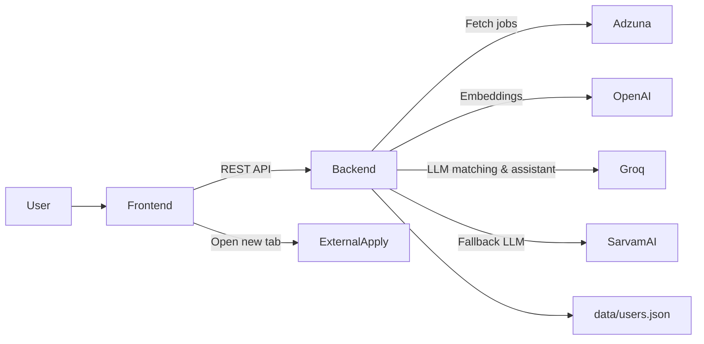
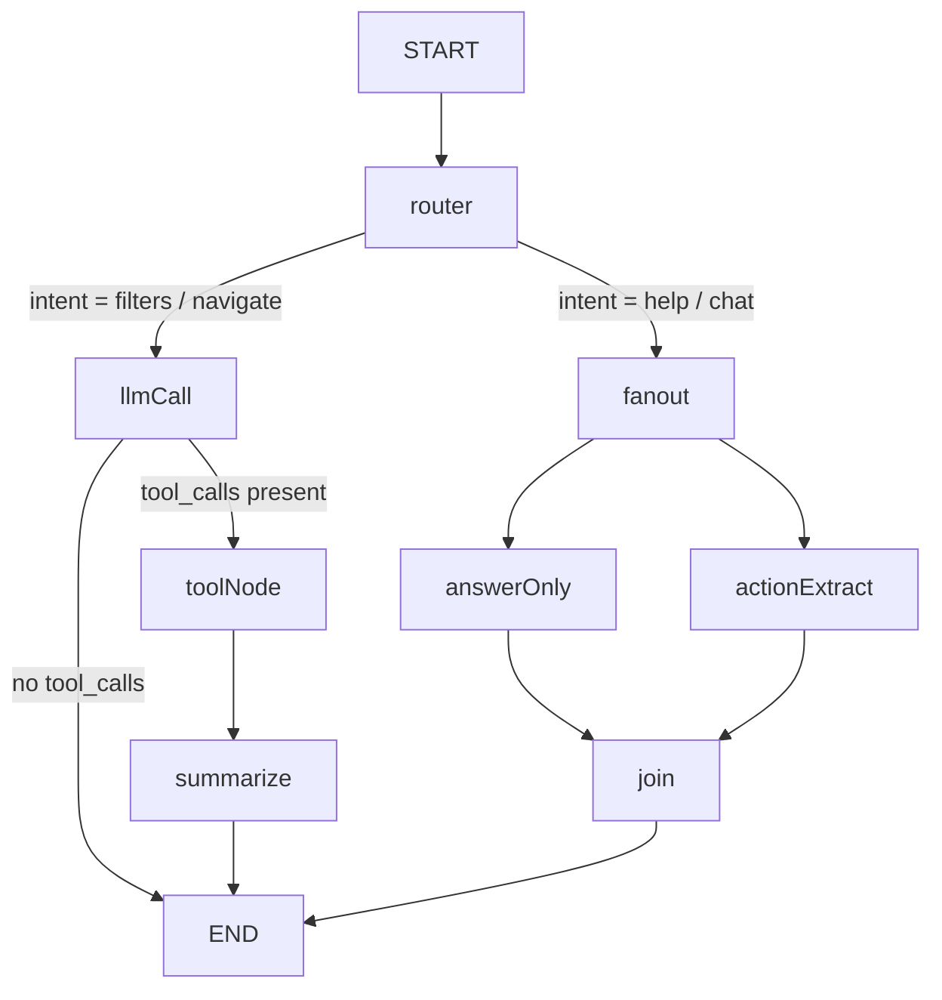

# AI-Powered Job Tracker with Smart Matching

React + Fastify job tracking platform that fetches real jobs from Adzuna, scores them against your resume using a **hybrid embedding + LLM pipeline** (LangChain), tracks applications with a "did you apply?" popup flow, and includes a **LangGraph-powered AI assistant** with intent routing, parallel nodes, and conversation memory that can control frontend filters in real time.

## Live demo

- **Frontend (Netlify)**: _add link_
- **Backend (Render)**: _add link_

## Architecture diagram



## Main components

- **Frontend (`frontend/`)** — React 19 + Vite SPA (TypeScript)
  - Pages: Login, Job Feed, Applications
  - Filters panel (sticky desktop / mobile drawer), Best Matches carousel, Job cards with match details
  - Smart "Did you apply?" popup (fires on tab return)
  - Floating AI assistant chat bubble with conversation memory
  - Save / Hide jobs (persisted in localStorage)
  - CSS animations, mobile-first responsive design
- **Backend (`backend/`)** — Fastify 5 API (TypeScript, ESM)
  - `POST /auth/login` · `GET /me` — simple token auth
  - `POST /resume` · `GET /resume` — PDF/TXT upload + text extraction
  - `GET /jobs` — Adzuna integration with mock fallback
  - `POST /match` — hybrid embedding + LLM matching (LangChain)
  - `GET /applications` · `POST /applications` · `PATCH /applications/:id`
  - `POST /ai/assistant` · `GET /ai/assistant/history` — LangGraph assistant
- **Storage** — `data/users.json` (JSON file, auto-created at runtime)

## Tech stack

| Layer | Technology |
|-------|-----------|
| Frontend | React 19, Vite 8, TypeScript, React Router 7 |
| Backend | Fastify 5, Node.js 22+, TypeScript (ESM) |
| AI Matching | LangChain, OpenAI Embeddings, Groq LLaMA via LangChain |
| AI Assistant | LangGraph (StateGraph, conditional edges, parallel nodes) |
| LLM Providers | Groq (primary), Sarvam AI (fallback) |
| Embeddings | OpenAI `text-embedding-3-small` (with local hash fallback) |
| Job Source | Adzuna API |
| Storage | JSON file (in-memory at runtime) |

## Setup instructions (local)

### Prerequisites

- Node.js **22+**
- npm

### 1) Install

```bash
npm install
npm install -w backend
npm install -w frontend
```

### 2) Configure environment variables

Copy `.env.example` to `.env` at the project root and fill in your keys:

| Variable | Required | Description |
|----------|----------|-------------|
| `ADZUNA_APP_ID` | Yes | Adzuna app ID |
| `ADZUNA_APP_KEY` | Yes | Adzuna app key |
| `ADZUNA_COUNTRY` | No | Country code (default `in`) |
| `GROQ_API_KEY` | Yes | Groq API key (primary LLM) |
| `GROQ_MODEL` | No | Groq model (default `meta-llama/llama-4-scout-17b-16e-instruct`) |
| `OPENAI_API_KEY` | Yes | OpenAI key for embeddings |
| `OPENAI_EMBEDDINGS_MODEL` | No | Embedding model (default `text-embedding-3-small`) |
| `SARVAM_API_KEY` | No | Sarvam AI key (fallback LLM) |
| `SARVAM_MODEL` | No | Sarvam model (default `sarvam-30b`) |
| `VITE_API_BASE_URL` | Yes | Backend URL (e.g. `http://localhost:4000`) |

### 3) Run dev servers

```bash
npm run dev
```

- Frontend: `http://localhost:5173/`
- Backend: `http://localhost:4000/health`

### Test credentials

- Email: `test@gmail.com`
- Password: `test@123`

## LangChain usage — Hybrid Matching Pipeline

### Where it lives

- `backend/src/matching.ts` — core matching logic
- `POST /match` endpoint in `backend/src/server.ts`

### How it works (two-stage hybrid pipeline)

#### Stage 1: Embedding Similarity (fast filtering)

1. Extract a resume profile (skills, titles, domains, years of experience) using Groq LLM via LangChain
2. Convert resume and every job description into embedding vectors using **OpenAI `text-embedding-3-small`** (falls back to local hash-based embeddings if unavailable)
3. Compute cosine similarity to rank all jobs
4. Select the **top 20** most similar jobs for LLM scoring

#### Stage 2: LLM Scoring (accurate matching)

1. Send each of the top 20 jobs + resume to **Groq LLaMA** via LangChain
2. The LLM returns for each job:
   - **Score** (0–100) — color-coded badge in UI
   - **Matching skills** — shown as green chips
   - **Missing skills** — shown as gray chips
   - **Explanation** — short reason shown on the card
3. Remaining jobs receive a scaled embedding similarity + heuristic score
4. All jobs are sorted by final score descending

### Why this design works

- **Speed** — embedding similarity is computed once per resume upload; only 20 jobs hit the LLM
- **Accuracy** — LLM scoring catches nuance that pure keyword overlap misses
- **Freshers vs seniors** — prompts enforce strict experience-level matching (senior roles penalized for freshers)
- **Fault tolerance** — tiered fallback: Groq → Sarvam AI → heuristic scoring; OpenAI embeddings → local hash embeddings

## LangGraph usage — AI Assistant

### Where it lives

- `backend/src/assistant.ts` — graph implementation
- `POST /ai/assistant` and `GET /ai/assistant/history` in `backend/src/server.ts`
- `frontend/src/components/AssistantChat.tsx` — floating chat bubble UI

### Graph structure (advanced LangGraph features)



**Key LangGraph features used:**

| Feature | Implementation |
|---------|---------------|
| **Conditional edges** | `router` → routes to `llmCall` or `fanout` based on detected intent |
| **Parallel nodes** | `fanout` triggers `answerOnly` + `actionExtract` concurrently |
| **State reducer** | `actions` uses an append-reducer to accumulate tool actions across nodes |
| **Conversation memory** | History persisted in `data/users.json` and loaded on each request |
| **Tool calling** | `setFilters`, `clearFilters`, `navigate` — LLM produces tool calls that the frontend executes |

### Intent routing

The `router` node classifies user messages into:
- **filters** / **navigate** → routed to `llmCall` (tool-calling LLM)
- **help** / **chat** → routed to `fanout` (parallel natural language response + action extraction)

### Conversation memory

- Chat history is stored per-user in `data/users.json` (`assistantHistory` field)
- Loaded via `GET /ai/assistant/history` when the chat panel opens
- Updated after every `POST /ai/assistant` exchange
- Full history is passed to the LLM for context-aware responses

### Tools / function calling (UI control)

The assistant uses tool calls to produce UI actions:

- `setFilters({patch})` — update specific filters (patch semantics)
- `clearFilters()` — reset all filters
- `navigate({to})` — switch pages (`/jobs` or `/applications`)

The backend returns:

```json
{
  "assistantText": "Showing only remote React jobs.",
  "actions": [
    { "type": "setFilters", "patch": { "workMode": "Remote", "skills": ["React"] } }
  ]
}
```

The frontend immediately executes returned actions to update the UI live.

## Smart "Did you apply?" popup flow

1. User clicks **Apply** → external URL opens in a new tab, pending record stored in `localStorage`
2. On return (focus / visibility change), a popup asks: *"Did you apply to [Job] at [Company]?"*
   - **Yes, Applied** → creates application with timestamp
   - **No, just browsing** → discards
   - **Applied earlier** → creates application with earlier timestamp
3. Deduplication by `jobId` prevents duplicate entries

## Application tracking

- Dashboard at `/applications` lists all tracked applications
- Status flow: Applied → Interview → Offer / Rejected
- Each application has a timeline of status changes

## Extra features

- **Save / Hide jobs** — persisted in localStorage, accessible from the feed
- **Mobile-first filters** — slide-up drawer on small screens, sticky sidebar on desktop
- **Animated UI** — chat panel open/close transitions, message pop-in animations, skeleton loaders for Best Matches
- **Auto-logout on 401** — handles backend restarts gracefully by redirecting to login

## Deployment

### Backend (Render)

The project includes a `render.yaml` for Render Blueprint deploys:

- Root directory: `backend/`
- Build: `npm install && npm run build`
- Start: `npm run start` (runs `node dist/server.js`)
- Health check: `/health`

Set these environment variables on Render dashboard:

| Variable | Value |
|----------|-------|
| `GROQ_API_KEY` | Your Groq key |
| `OPENAI_API_KEY` | Your OpenAI key |
| `ADZUNA_APP_ID` | Your Adzuna app ID |
| `ADZUNA_APP_KEY` | Your Adzuna app key |
| `ADZUNA_COUNTRY` | `in` (or your country) |
| `SARVAM_API_KEY` | _(optional)_ Sarvam AI key |
| `HOST` | `0.0.0.0` |
| `PORT` | Render sets this automatically |

### Frontend (Netlify)

Uses `netlify.toml`:

- Build: `npm run build -w frontend`
- Publish: `frontend/dist`

Set on Netlify:

| Variable | Value |
|----------|-------|
| `VITE_API_BASE_URL` | `https://<your-render-backend>.onrender.com` |

## Scalability notes

### 100+ jobs

- Client-side filtering handles 100–500 jobs with no lag
- Only the top 20 jobs hit the LLM; the rest use fast embedding scores

### 10,000 users

- Replace JSON storage with Postgres + per-user indexing
- Add JWT/sessions in Redis for proper auth
- Background workers for matching and caching
- Paginate external job pulls

## Tradeoffs / limitations

- Storage is JSON-based (simple by design for the assignment)
- Matching quality depends on resume text extraction and LLM availability
- Work mode / job type inference from descriptions is heuristic-based
- Embedding quality degrades with local hash fallback (used only when API keys are missing)

## Repo / security checklist

- No secrets committed
- `.env.example` provided with placeholder values
- Add your `.env` locally only
- `.gitignore` covers `dist/`, `node_modules/`, `data/*.json`, `.env`
